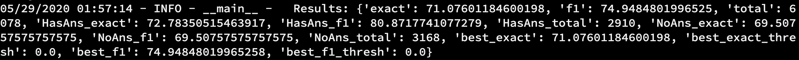

## BaseLine

```txt
F1: 52.19
EM: 52.19
```

## BERT_Base

```txt
'exact':71.076
'f1':74.948
'HasAns_exact':72.784
'HasAns_f1':80.872
'NoAns_exact':69.508
'NoAns_f1':69.508
```



## ALBERT

```txt
'exact':78.266
'f1':81.581
'HasAns_exact':75.567
'HasAns_f1':82.491
'NoAns_exact':80.745
'NoAns_f1':80.745
```


## XLNet

TODO

